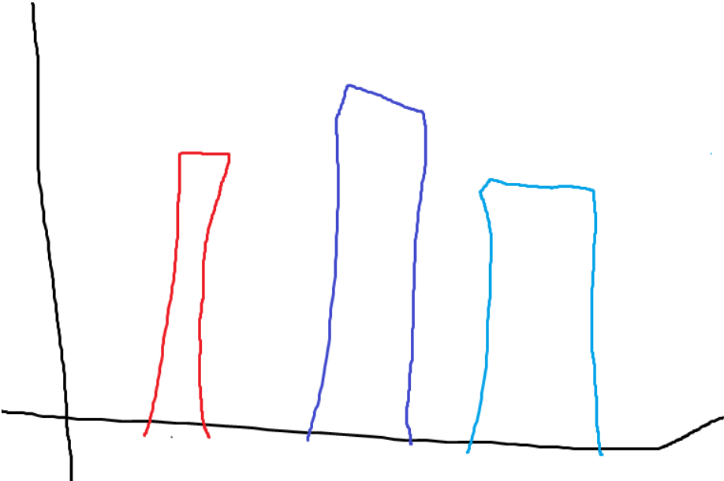

This is a document.

Here is a table:

\begin{tabular}{ccc}
**Some data** & **More data** & **Different data**\\
A & 1 & Something\\
b & 3 & Blah blah blah\\
\end{tabular}

Here’s an equation:

\(f(x)=a_0+\sum_{n=1}^\infty\left(ancos\frac{n\pi x}{L}+b_nsin\frac{n\pi x}{L}\right)\)

Here’s a figure/image:

